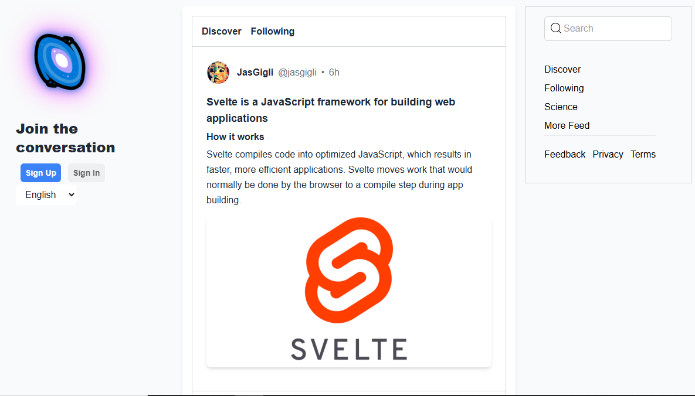

# 🌌 **GigliSky - The Future of Social Media**

Welcome to **GigliSky**, the social media app built for seamless communication and connection. GigliSky redefines the way you interact with the world by providing a clean, modern interface and innovative features tailored to you.

---

## 🌟 **Features**

✅ **Authentication**: Secure login and signup powered by Clerk.  
✅ **Feeds**: Scroll through the latest content and engage with your network.  
✅ **Responsive Design**: Optimized for mobile, tablet, and desktop.  
✅ **Search**: Discover people, topics, and trends easily.  
✅ **Profile Customization**: Personalize your space with avatars and bios.  
✅ **Settings**: Control your preferences with an intuitive settings page.  
✅ **Dark Mode** (coming soon 🚀).

---

## 💻 **Tech Stack**

GigliSky is built using cutting-edge technologies for performance and scalability:

- **Frontend**: React.js, Tailwind CSS
- **Backend**: Node.js (Future API support)
- **Authentication**: Clerk
- **Routing**: React Router
- **Hosting**: Vercel

---

## 🚀 **Getting Started**

Follow these simple steps to run GigliSky locally:

### 1️⃣ Clone the Repository

```bash
git clone https://github.com/jasgigli/giglisky.git
cd giglisocial
```

### 2️⃣ Install Dependencies

```bash
npm install
```

### 3️⃣ Add Environment Variables

Create a `.env` file and add your Clerk API keys:

```env
REACT_APP_CLERK_FRONTEND_API=<your-frontend-api>
REACT_APP_CLERK_API_KEY=<your-api-key>
```

### 4️⃣ Start the App

```bash
npm start
```

🌐 Visit the app at [http://localhost:3000](http://localhost:3000).

---

## 📂 **Folder Structure**

```
📦 giglisocial
├── 📁 src
│   ├── 📁 components
│   │   ├── Navbar
│   │   ├── Search
│   │   ├── Auth
│   │   └── Feed
│   ├── 📁 pages
│   │   ├── ProfilePage
│   │   ├── SignUpPage
│   │   └── SignInPage
│   ├── Layout.js
│   └── App.js
└── README.md
```

---

## ✨ **Screenshots**

### 🌟 **Home Page**



---

## 🛠️ **Future Enhancements**

🔜 **Dark Mode**  
🔜 **Direct Messaging**  
🔜 **Push Notifications**  
🔜 **AI-Powered Recommendations**

---

## 🌍 **Contributing**

We welcome contributions! To get started:

1. Fork the repo.
2. Create a new branch (`feature/my-awesome-feature`).
3. Commit your changes.
4. Submit a pull request.

---

## 📞 **Contact**

👨‍💻 Developed by **[JasGigli](https://jasgigli.vercel.app)**  
📧 Email: overview.jjj@gmail.com

---

## ⭐ **Show Your Support**

If you love GigliSky, give this project a ⭐ on GitHub and share it with your friends!

🌟 **Let’s connect the world, one post at a time!** 🌟
